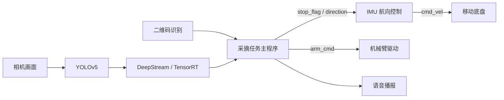
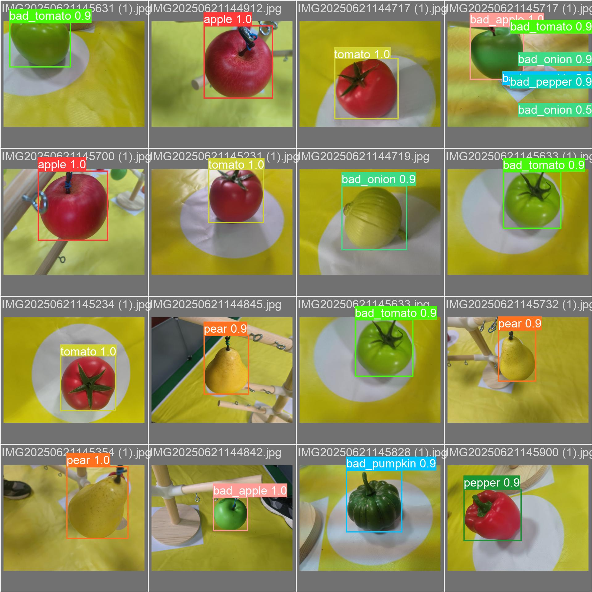

# 基于深度学习的智能授粉采收机器人系统

本项目面向结构化农业赛道，完成二维码任务读取、底盘运动控制、目标识别、机械臂采摘/移除和语音播报。仓库保留比赛期间实际使用的 ROS 脚本，仅进行了文件归类、编码统一和说明补充，核心控制逻辑未重新设计。

## 我的主要工作

- 编写采摘任务主程序，完成 A/C 区任务调度、拓扑点位映射、底盘与机械臂动作编排。
- 设计基于初始航向和 IMU 实时反馈的转向控制，使车辆能够以启动方向为全局参考完成直行、左右转和停止对齐。
- 训练 YOLOv5s 果蔬状态识别模型，并完成 DeepStream/TensorRT 车端部署和 ROS 视觉接口联调。
- 编写机械臂串口驱动及简易调试程序，通过动作编号执行预先调试好的识别、采摘、移除和复位轨迹。
- 完成二维码识别、导航测试、雷达数据读取及整车联调。

## 系统流程



## 建议阅读顺序

| 文件 | 作用 | 推荐关注内容 |
| --- | --- | --- |
| [`new_scra.py`](ros/agrc_base_arm/scripts/new_scra.py) | 采摘任务主程序 | A/C 区任务、拓扑点位映射、视觉决策、动作与播报时序 |
| [`aicar_pid_line_turn.py`](ros/agrc_base_arm/scripts/aicar_pid_line_turn.py) | IMU 航向控制 | 初始航向采样、角度归一化、PID、转向和停止对齐 |
| [`new_arm.py`](ros/agrc_base_arm/scripts/new_arm.py) | 机械臂驱动 | ROS 动作编号、YAML 轨迹、串口 JSON 指令 |
| [`Qr_detect.py`](ros/agrc_base_arm/scripts/Qr_detect.py) | 二维码识别 | CLAHE、自适应阈值、任务序列发布 |
| [`get_scan_data.py`](ros/agrc_base_arm/scripts/get_scan_data.py) | 雷达数据读取 | 指定角度距离提取 |
| [`navigation_test_goal.py`](ros/agrc_base_arm/scripts/navigation_test_goal.py) | 导航测试 | 依次向 `move_base` 发送目标点 |
| [`small_arm_driver.py`](ros/agrc_base_arm/scripts/small_arm_driver.py) | 机械臂调试工具 | 键盘关节控制、串口指令和视觉对位实验 |

更详细的入口、依赖和面试讲解重点见 [`docs/code-guide.md`](docs/code-guide.md)。

## 两个核心实现

### 1. 基于初始航向的全角度转向控制

车辆启动后连续采样 IMU yaw 作为 `base_yaw`，直行和左右转的目标方向分别表示为 `base_yaw`、`base_yaw + pi/2` 和 `base_yaw - pi/2`。控制器通过 `atan2(sin(error), cos(error))` 将角度误差归一化到 `[-pi, pi]`，避免跨越正负 180 度时方向判断错误，再通过 PID、角速度限幅和输出渐变控制底盘。

这个方法的重点不是依赖地图中的绝对朝向，而是始终以车辆启动姿态为全局参考，因此更适合比赛现场初始摆放角度存在偏差的情况。

### 2. 结构化赛道的拓扑点位执行

主程序把 1 到 12 号任务点映射为“通道编号 + 通道内行号”。同一通道根据行号差前进或后退；跨通道时先退出当前通道、执行换道，再进入目标通道。该方法针对固定赛道，调试成本低、执行过程直观。

## 视觉训练结果

果蔬模型采用 YOLOv5s，输入尺寸 640，训练 100 个 epoch。最后一轮本地验证集结果如下：

| Precision | Recall | mAP@0.5 | mAP@0.5:0.95 |
| ---: | ---: | ---: | ---: |
| 0.980 | 0.993 | 0.991 | 0.855 |



训练配置、完整曲线和混淆矩阵位于 [`vision/yolov5`](vision/yolov5)。DeepStream 配置和修改过的结果解析接口位于 [`vision/deepstream`](vision/deepstream)。模型权重和 TensorRT engine 体积较大且依赖具体设备，因此未上传。

## 运行顺序

真实机器人需要 ROS、底盘驱动、IMU、机械臂串口和 NVIDIA DeepStream 环境。典型启动顺序为：

```bash
roslaunch agrc_base_arm base_control.launch
roslaunch agrc_base_arm arm_control.launch
roslaunch agrc_base_arm harvest_mission.launch
```

DeepStream 推理与二维码节点需按任务单独启动。配置中的串口号、音频路径、摄像头编号和运动参数需要根据设备修改。

## 项目说明

- 代码是比赛阶段的实际工程版本，保留了部分现场调试写法和硬件路径，重点用于项目展示与面试复盘。
- 当前二维码脚本发布 `/fruit_array`，采摘主程序订阅 `/Qr_scan`，对应不同现场版本；接口差异已在 [`docs/ros-topics.md`](docs/ros-topics.md) 中说明。
- 路径执行针对结构化赛道，部分路段仍使用时间参数，不是通用 SLAM 导航方案。
- 实车运行图片和视频将在资料取回后补充到 [`assets/videos`](assets/videos)。

## License

本仓库包含基于 YOLOv5 和 DeepStream-Yolo 的配置与接口代码，第三方来源见 [`THIRD_PARTY.md`](THIRD_PARTY.md)。仓库按 AGPL-3.0 发布。
