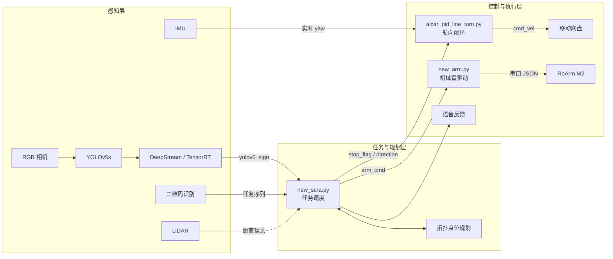
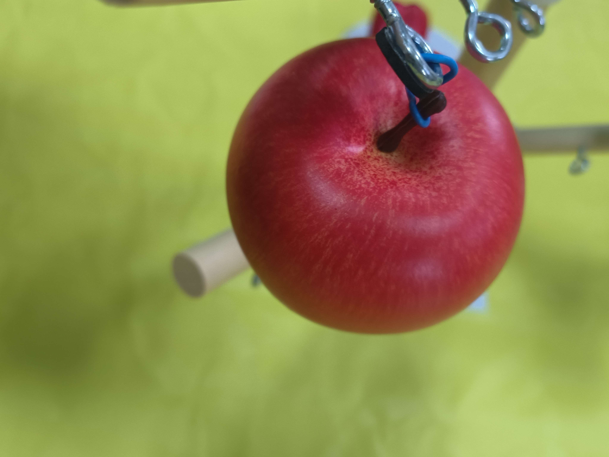
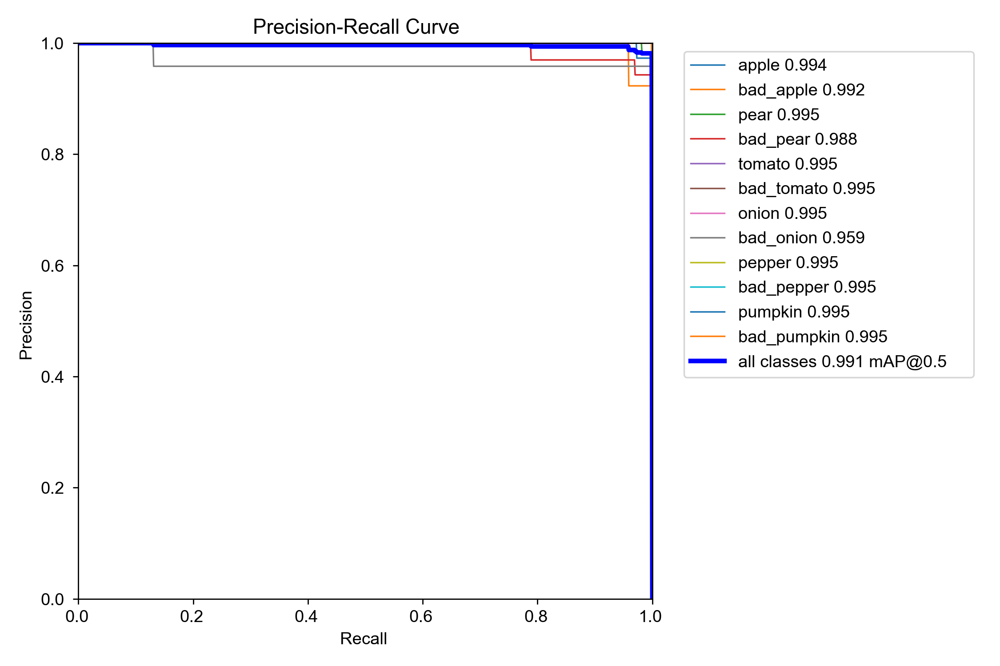
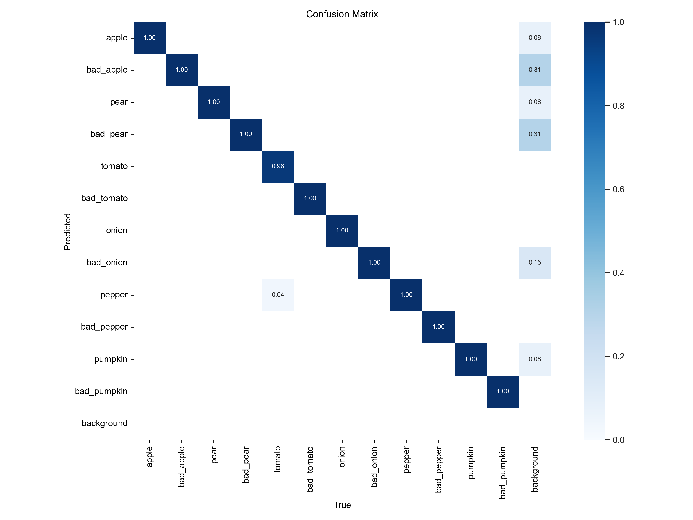
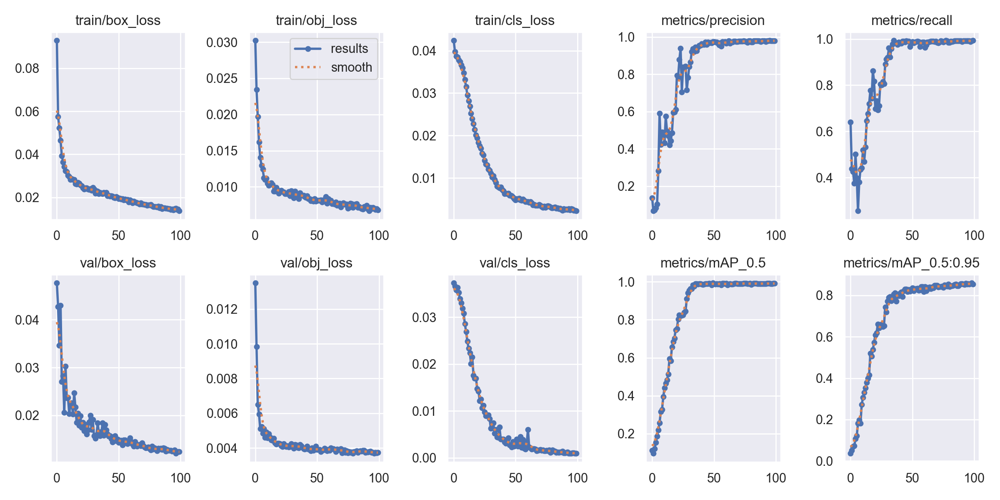

# 基于深度学习的智能授粉采收机器人系统

面向结构化农业场景构建的 ROS 多模块协同机器人系统，打通目标识别、二维码任务读取、拓扑路径执行、IMU 航向控制、机械臂作业与语音反馈的完整链路。

**项目周期：** 2025.05 - 2026.06

**技术栈：** ROS1 · Python · C/C++ · YOLOv5s · OpenCV · DeepStream · TensorRT · IMU · LiDAR · RoArm M2

## 项目成果

- 2025 年全国大学生信息安全大赛“采收机器人赛道”国家一等奖
- 2025 年睿抗机器人开发者大赛“智灌采收赛道”国家三等奖
- 雌花/雄花模型在本地验证集上取得约 `0.995` 的 mAP@0.5
- 果蔬成熟/腐烂状态模型在本地验证集上取得约 `0.991` 的 mAP@0.5

## 项目概述

系统以移动底盘为载体，通过相机、IMU、激光雷达和二维码获取环境与任务信息。ROS 任务节点根据二维码序列规划作业顺序，控制底盘到达目标点；视觉模型判断目标类别与状态，任务层据此触发机械臂识别、采摘、移除、授粉或复位动作，并完成语音反馈。

项目重点解决三个实际问题：结构化赛道中的稳定连续运动、车载端视觉模型的实时部署，以及视觉、底盘、机械臂之间具有严格时序关系的多模块协同。仓库当前以完成度更高的采摘任务链为主，保留了项目运行阶段的真实脚本、参数与视觉结果。

## 个人贡献

- 编写 ROS 任务主程序，完成目标检测、二维码解析、底盘运动、机械臂动作和语音反馈的协同调度。
- 针对初始摆放角度和底盘累计偏航问题，设计基于初始航向与 IMU yaw 反馈的全角度闭环转向控制。
- 将任务点抽象为“通道号 + 点位编号”，实现结构化赛道中的拓扑路径执行与跨通道切换。
- 基于自采农业场景数据训练 YOLOv5s，完成雌雄花分类以及果蔬成熟、腐烂状态识别。
- 完成 YOLOv5 模型的 DeepStream/TensorRT 部署，并将车端推理结果接入 ROS 控制链路。
- 设计 CLAHE 增强与二维码解码流程，改善强反光、局部光照不均情况下的任务读取效果。
- 编写机械臂串口驱动与调试工具，通过动作编号调用预设轨迹，完成识别、采摘、移除和复位。

## 系统架构



## 任务执行流程

1. 二维码节点读取作业目标与任务点序列。
2. 主程序将目标编号映射到拓扑通道和通道内点位，生成移动顺序。
3. 主程序通过 `/stop_flag` 和 `/direction` 发布运动意图，IMU 控制节点输出 `/cmd_vel`。
4. 到达目标点后，机械臂先运动到识别姿态，系统等待视觉结果稳定。
5. 任务层根据类别选择跳过、采摘、移除或授粉动作，并播放对应语音。
6. 机械臂复位，底盘继续执行下一个任务点。

## 核心技术

### 1. 基于初始航向的全角度闭环控制

机器人启动后连续采样多帧 IMU yaw，得到初始航向 `base_yaw`。直行、左转和右转不依赖地图中的绝对方向，而是分别设置为：

```text
直行目标：base_yaw
左转目标：base_yaw + pi/2
右转目标：base_yaw - pi/2
```

角度误差通过以下方式归一化到 `[-pi, pi]`：

```text
error = atan2(sin(target_yaw - current_yaw),
              cos(target_yaw - current_yaw))
```

该处理避免了航向跨越正负 180 度时的方向突变。PID 输出进一步经过角速度限幅、死区处理和渐变约束，车辆停止后继续进行小角度对齐，从而减少连续路段中的累计偏航。对应代码见 [`aicar_pid_line_turn.py`](ros/agrc_base_arm/scripts/aicar_pid_line_turn.py)。

### 2. 结构化场地的拓扑路径执行

主程序将 1 到 12 号任务点映射为 `(road, row)`：`road` 表示通道，`row` 表示通道内点位。同一通道内根据行号差决定前进或后退；跨通道时先退出当前通道，再执行换道并进入目标通道。共享点位单独标记，避免重复换道。

相比连续坐标规划，该方法充分利用了场地结构固定、任务点离散的特点，路径逻辑直观，现场参数调整成本较低。拓扑映射和执行逻辑位于 [`new_scra.py`](ros/agrc_base_arm/scripts/new_scra.py)。

### 3. YOLOv5 到 DeepStream/TensorRT 的车端部署

视觉部分使用自采农业场景数据训练 YOLOv5s，随后将模型转换为 DeepStream-Yolo 可加载的格式，并在 NVIDIA 平台上生成 TensorRT engine。自定义 bbox parser 对检测结果进行置信度过滤，再由 ROS 视觉桥接节点发布给任务主程序。

```text
自采数据集 -> YOLOv5s 训练 -> 模型转换
          -> DeepStream / TensorRT 推理
          -> 结果解析 -> ROS 视觉话题 -> 任务决策
```

训练配置与结果位于 [`vision/yolov5`](vision/yolov5)，DeepStream 配置及解析接口位于 [`vision/deepstream`](vision/deepstream)。

### 4. 机械臂预设动作组

目标位置在结构化场景中相对固定，因此系统没有在任务节点中实时计算每个关节角，而是预先调试识别、采摘、移除、授粉和复位轨迹。主程序发布动作编号，机械臂驱动从 YAML 中读取对应轨迹，并通过串口逐点发送 JSON 指令。

这种设计降低了任务层复杂度，也便于根据现场目标位置直接调整动作参数。驱动实现见 [`new_arm.py`](ros/agrc_base_arm/scripts/new_arm.py)，轨迹参数见 [`RoArm_M2.yaml`](ros/agrc_base_arm/config/RoArm_M2.yaml)。

### 5. 复杂光照下的二维码读取

二维码节点依次执行灰度化、CLAHE 局部对比度增强、自适应阈值与 `pyzbar` 解码。CLAHE 以局部区域为单位增强黑白边界，并限制对比度放大，可减轻局部过曝、阴影和反光对解码的影响。实现见 [`Qr_detect.py`](ros/agrc_base_arm/scripts/Qr_detect.py)。

## 视觉结果

| 模型 | 任务 | Precision | Recall | mAP@0.5 | mAP@0.5:0.95 |
| --- | --- | ---: | ---: | ---: | ---: |
| 雌雄花模型 | female / male | 0.989 | 1.000 | 0.995 | 0.836 |
| 果蔬状态模型 | 13 类成熟/腐烂状态 | 0.980 | 0.993 | 0.991 | 0.855 |

以上指标来自本地验证集。实际运行效果仍会受到光照、拍摄角度、遮挡和运动模糊影响。

<p align="center">
  
</p>

<p align="center">果蔬识别数据采集实验：悬挂目标与结构化作业背景</p>

<p align="center">
  
  
</p>

<p align="center">果蔬模型 PR 曲线与混淆矩阵</p>



完整训练日志和验证批次预测图保留在 [`vision/yolov5/results/harvest`](vision/yolov5/results/harvest)，用于查看各类别的原始验证表现。

## 仓库结构

```text
ROS-pollinate-and-scratch/
├── ros/agrc_base_arm/
│   ├── scripts/              # 任务、底盘、机械臂、二维码及辅助脚本
│   ├── config/               # 任务参数与机械臂预设轨迹
│   └── launch/               # ROS 启动文件
├── vision/
│   ├── yolov5/               # 训练配置、指标与验证结果
│   └── deepstream/           # 部署配置与自定义解析接口
├── docs/                     # 系统流程、代码导览与 ROS 话题说明
└── assets/                   # 识别结果及实车媒体材料
```

## 代码导航

| 文件 | 主要功能 | 关键内容 |
| --- | --- | --- |
| [`new_scra.py`](ros/agrc_base_arm/scripts/new_scra.py) | 任务主程序 | A/C 区任务、拓扑映射、视觉决策、动作与播报时序 |
| [`aicar_pid_line_turn.py`](ros/agrc_base_arm/scripts/aicar_pid_line_turn.py) | 底盘航向控制 | 初始航向采样、角度归一化、PID 与停止对齐 |
| [`new_arm.py`](ros/agrc_base_arm/scripts/new_arm.py) | 机械臂驱动 | 动作编号、YAML 轨迹、串口 JSON 指令 |
| [`Qr_detect.py`](ros/agrc_base_arm/scripts/Qr_detect.py) | 二维码识别 | CLAHE、自适应阈值、任务序列解析 |
| [`get_scan_data.py`](ros/agrc_base_arm/scripts/get_scan_data.py) | 雷达数据读取 | 指定方向距离提取 |
| [`navigation_test_goal.py`](ros/agrc_base_arm/scripts/navigation_test_goal.py) | 导航测试 | 向 `move_base` 依次发送目标点 |
| [`small_arm_driver.py`](ros/agrc_base_arm/scripts/small_arm_driver.py) | 机械臂调试工具 | 键盘关节控制、串口通信和视觉对位实验 |

完整的模块入口与依赖见 [`docs/code-guide.md`](docs/code-guide.md)，ROS 话题约定见 [`docs/ros-topics.md`](docs/ros-topics.md)。

## 运行环境

- Ubuntu + ROS1
- Python 2/3、OpenCV、pyzbar、pyserial
- NVIDIA DeepStream + TensorRT
- IMU、2D LiDAR、RGB 相机
- 移动底盘与 RoArm M2 机械臂

典型启动顺序：

```bash
roslaunch agrc_base_arm base_control.launch
roslaunch agrc_base_arm arm_control.launch
roslaunch agrc_base_arm harvest_mission.launch
```

DeepStream 推理和二维码节点需根据任务单独启动。串口号、摄像头编号、音频路径、速度及机械臂轨迹参数需要结合设备配置。

## 当前限制与改进方向

- 路径执行针对固定结构化场地，部分路段仍依赖运动时间参数，可进一步接入 AMCL 或其他定位反馈。
- 当前 DeepStream 与 ROS 之间采用中间文件桥接，便于调试但实时性有限，可改为共享内存或直接发布 ROS 消息。
- 项目调试过程中存在二维码话题和视觉消息格式的版本差异，具体说明见 [`docs/ros-topics.md`](docs/ros-topics.md)。
- 模型权重和 TensorRT engine 与设备环境相关，未纳入仓库；实车运行视频与图片将在资料整理后补充。

## License

本仓库包含基于 YOLOv5 和 DeepStream-Yolo 的配置与接口代码，第三方来源见 [`THIRD_PARTY.md`](THIRD_PARTY.md)。仓库按 AGPL-3.0 发布。
