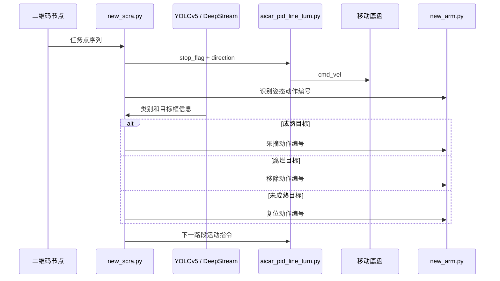

# 系统执行流程

## 启动与任务执行

## C 区拓扑点位

任务点用 `(road, row)` 表示。路径执行只关心当前点和目标点之间的拓扑关系：

- `road` 相同：根据 `row` 差值前进或后退；
- `road` 不同：退出当前通道，执行换道动作，再进入目标通道；
- 共享点位：避免重复执行不必要的换道。

这种方法针对固定比赛场地，不依赖完整二维地图，但需要提前标定每段运动时间。
